<!-- profile-forge:start -->
<div align="center">

<h3><code>alessio@github ~ $ ./contributions.sh</code></h3>



<br><br>

<h3><code>alessio@github ~ $ whoami</code></h3>

<table>
  <tr>
    <td valign="top"></td>
    <td valign="top"></td>
  </tr>
</table>

</div>
<!-- profile-forge:end -->

# profile-forge

Your GitHub profile as a terminal: an ASCII portrait that types itself in, a
neofetch-style info card, and your real contribution calendar revealing itself
box by box — refreshed every day by a GitHub Action.

No third-party stats services. No access token. No JavaScript. Three
self-contained animated SVGs, generated in your own repo, committed to your
own repo. Nothing to go down, nothing to rate-limit you.

**Two ways to get it. Pick one.**

---

## 1 · The prompt

If you use an agentic coding tool — Claude Code, Cursor, Codex, Copilot
Agent — copy [**PROMPT.md**](./PROMPT.md) and paste it in. It will read your
photo, build the pipeline, and explain each decision as it goes. You end up
owning code you understand rather than a black box.

```
Requirements: an agentic coding tool, Python 3.9+, and a photo of yourself.
Time: about 10 minutes, most of it the agent working.
```

## 2 · The template — no terminal, works from your phone

<table>
  <tr><td><b>1</b></td><td>Click <b>Use this template</b> → <b>Create a new repository</b>.<br>Name the repo <b>exactly your GitHub username</b>. That is the repo GitHub shows on your profile.</td></tr>
  <tr><td><b>2</b></td><td>Open <code>assets/</code> → <b>Add file</b> → <b>Upload files</b> → drop in a photo of yourself, named <code>photo.jpg</code>.<br>Straight from your camera roll is fine — <code>.heic</code> from an iPhone works too.</td></tr>
  <tr><td><b>3</b></td><td>Open <code>profile.yml</code>, click the pencil, replace my details with yours, commit.</td></tr>
</table>

That last commit starts the build. Watch it under the **Actions** tab; in two
or three minutes it commits your finished art and rewrites this README around
it. Nothing to install, nothing to run.

**Your photo matters more than any setting.** One face, looking at the camera,
clearly lit, ideally against a plain background. A group photo, a full-body
shot or heavy shadow all convert to mush — the pipeline is good, not magic.

---

## What the three pieces are

| File | What it is |
|---|---|
| `ascii-portrait.svg` | Your photo as monochrome ASCII. The background is removed, local contrast is boosted, and each row wipes in left-to-right with a cursor riding the edge. Plays once, then freezes. |
| `info-card.svg` | The card on the right, built entirely from `profile.yml`. Deliberately holds no statistics — the heatmap covers those. This is for what numbers cannot say. |
| `contrib-heatmap.svg` | Your real 53-week calendar, scraped from your own public contributions page. Reveals diagonally, and every box has a native tooltip with its date and count. |

## Editing it later

Everything lives in `profile.yml`. Change it, commit, and the art rebuilds.

```yaml
user: alessio                      # shown as user@host, like a shell prompt
host: builtwithsabba
card:
  - Role: AI Builder & Founder     # add, remove and reorder freely
  - Now: FiscEdge
  - "": a second line for the row above
motto: Build with AI. Think like a founder.
accent: "#6366f1"                  # card labels and the typing cursor
ascii_columns: 100                 # portrait detail; 80-120 is useful
```

Swapped your photo? That commit rebuilds the portrait on its own.

## Running it locally

```bash
pip install -r scripts/requirements.txt
python scripts/prep_photo.py          # background removal + grading
python scripts/make_ascii_svg.py
python scripts/make_info_card.py
python scripts/fetch_contributions.py # GH_USER=you, if not in Actions
python scripts/render_heatmap_svg.py
python scripts/render_readme.py       # solves the display widths
```

`STATIC=1` on any generator emits a frozen frame, which is what you want when
previewing locally — an animation that has already finished looks like a blank
panel.

## The parts that are harder than they look

Four things cost real time to get right. They are commented in the scripts,
but the short version:

**A README SVG cannot know your theme.** Loaded through ``, it cannot
read whether GitHub is in light or dark mode, so light glyphs on a transparent
background vanish for half your visitors. Every panel here paints its own dark
terminal background and looks identical either way.

**Dark hair carries no brightness.** Any framing that looks for bright pixels
to find the head will crop the top of it off. Framing is measured from the
cutout silhouette instead, which is the only thing that knows where hair ends.

**Renderers collapse whitespace inside `<text>`**, even under
`white-space: pre`. The surviving glyphs spread across the row and the portrait
wobbles. So no space is ever emitted: each row is split into runs of non-space
characters, each placed at its own absolute `x` with an explicit `textLength`.

**The two panels only align if their aspect ratios match**, and the card's
height depends on how many rows you wrote. So the widths are solved on every
build from the rendered files, not hardcoded — that is what the markers at the
top of this file are for.

## Credits

Built by [Alessio Sabatino](https://www.builtwithsabba.com) · the approach is
adapted from [Avi Vashishta's write-up](https://avivashishta.com) on animating
a profile README with self-contained SVGs.

MIT licensed. Make it yours.
